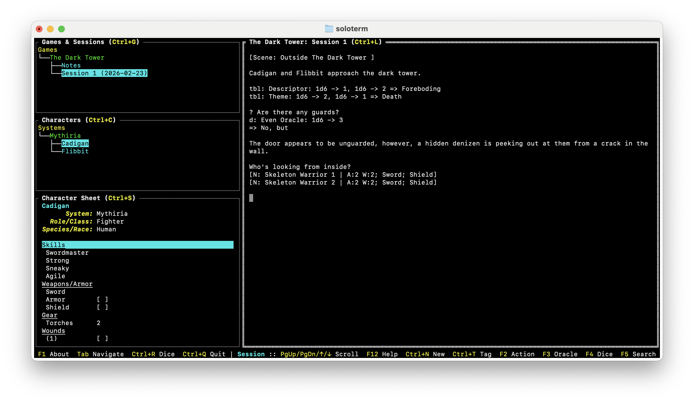
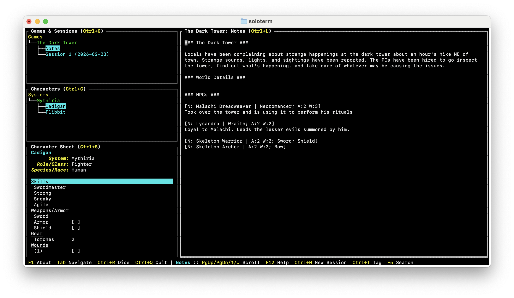
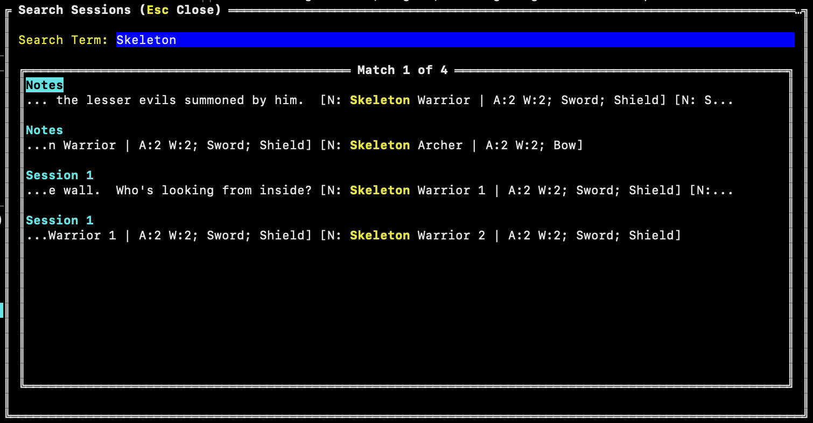

# Terminal App for Tracking Solo TTRPG Sessions

This started out as a project to learn the Go programming language and turned into something I've been using to track my solo TTRPG sessions.

People expressed interest in it, so I thought I'd put it up here on Github.

So, the code may not be the best quality, but it does work!

To install, download the latest executable from [Releases](https://github.com/curtp/soloterm/releases).

To see where the data and logs are written, press F1.

## Features
* Create multiple games and track multiple sessions per game
* Create simple characters for quick reference in the app
* Support for tags and quick notations based on [Lonelog](https://zeruhur.itch.io/lonelog)
* Dice Rolling
* Searching game sessions
* Mouse free navigation
* Import/Export session logs

## Games
Games are just a name for adding session logs to. You'll need to add a game before adding logs.

## Sessions
Sessions is just a text area where you can type out your log. There's no formatting available here. It's just a simple text editor.

You can import/export session logs however, so those who like to use Markdown can still do so. It just won't be formatted in the terminal.

### Lonelog Tags

Check out [Lonelog](https://zeruhur.itch.io/lonelog) for using tags in your TTRPG session logs.

When logging your session, you can press keys (F2 = Character Action, F3 = Oracle Question, F4 = Dice) to quickly insert a template. Press Ctrl+T to open up the tag modal to select a template to insert.

The Active Tags section displays the list of "open" tags from all of the logs in the game.

The Notes Tags section includes tags that are in the Notes seciton of the game.

Picking one of those tags will insert it into the log where you can fill out the details.

### Configuring Tags
When the application starts, it creates a config.yaml file which you can edit to change the tags which are available. See the log written to the terminal when the application starts to see where the config.yaml file is located.

## Notes

Seperate from sessions is a notes section. Notes are for tracking things that live on beyond sessions, like key NPCs, adventure hooks, locations.

## Searching

You can search notes and sessions, then quickly jump to the entry by selecting it from the list of results.

## Characters

There are 2 sections for managing characters in the app. The top section is where you add a characters information (name, system, role, species). The bottom section is the sheet where you track attributes.

The sheet is a list of name/value entries. Entries can be standalone or grouped under a section header. Sections keep related entries together and move as a group.

It's recommended to track only simple things here. It's not a rich character sheet by any means.

Depending on the game you're playing, the entire character sheet may fit in this area.

## Rolling Dice

You can roll dice from anywhere in the app. It follows the typical dice notation and allows tagging rolls with a label.

When lauching the roller from within the session log, you can insert the roll result where the cursor is in the text area.

# Contributing/Reporting Issues
This is a little side project that I used to learn Go. I don't intend this to be an application I plan on building a support structure around.

* If you want to fork the code and alter it, go for it. The license is MIT, so do what you want.
* PRs welcome! But please file bugs and or enhancements and refer to them.
* If you find a problem with the app, I'm not surprised. I've tested it and used Claude to help me write tests, so there shouldn't be anything huge. Feel free to open an issue here and if I get time I'll check it out. Or, if you like, fix it and submit a PR.
